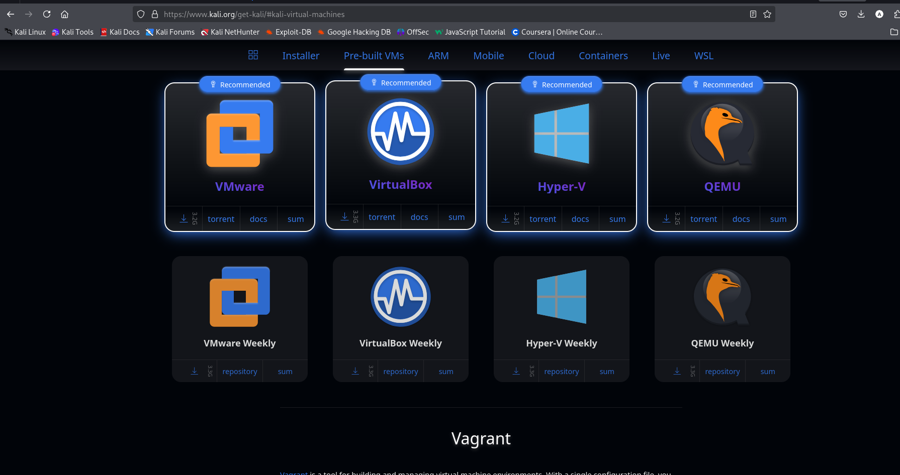
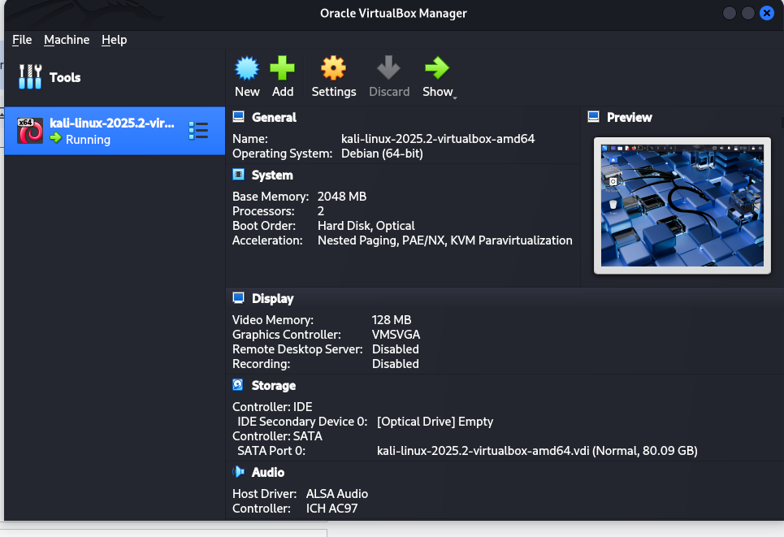

# 🐉 Installing Kali Linux Inside Kali Using VirtualBox

This guide walks you through the step-by-step process of installing **Kali Linux inside another Kali system** using **Oracle VirtualBox**.

---

## 📥 Step 1: Download Kali VirtualBox Image

Visit the [official Kali downloads page](https://www.kali.org/get-kali/#kali-virtual-machines) and download the VirtualBox image.



---

## 🧰 Step 2: Install Dependencies and VirtualBox

Run the following commands to install required packages:

```bash
sudo apt update
sudo apt install -y gcc make perl dkms build-essential
```

Then download the correct `.deb` package for your distribution from the [VirtualBox Linux Downloads](https://www.virtualbox.org/wiki/Linux_Downloads) page.

> Example for Debian Bookworm:

```bash
sudo dpkg -i virtualbox-7.1_7.1.12-169651~Debian~bookworm_amd64.deb
sudo apt --fix-broken install
```

If there are missing dependencies, use:

```bash
sudo apt --fix-broken install
```


---

## ⚙️ Step 3: Launch VirtualBox

Launch VirtualBox from your menu or terminal.

```bash
virtualbox
```

You should see the VirtualBox GUI.


---

## 🆕 Step 4: Import Kali VirtualBox Image

Click on **Import**, then select the `.ova` file you downloaded and follow the wizard.


---

## 🖥️ Step 5: Run Your Kali VM

Once imported, select the VM and click **Start**.



---

## 🎉 Done!

You now have Kali running inside Kali!


---

## 🔧 Troubleshooting

If you get the `Kernel driver not installed (rc=-1908)` error:

```bash
sudo apt install linux-headers-$(uname -r)
sudo modprobe vboxdrv
```

> Make sure your current kernel has matching headers. You can verify your kernel using `uname -r`.

---

> 📸 Screenshots and documentation created by [Amal](https://github.com/amalpvatayam67)