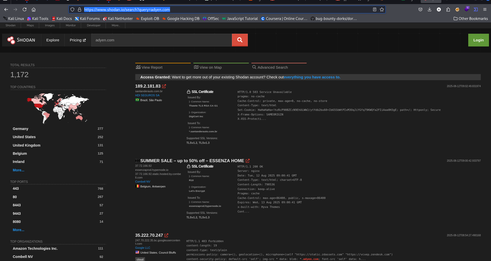

# Adyen

Adyen is a Dutch payment company with the status of an acquiring bank that allows businesses to accept e-commerce, mobile, and point-of-sale payments. It is listed on the stock exchange Euronext Amsterdam. Adyen offers merchants online services to accept electronic payments.

Headquarters: Amsterdam, Netherlands

Founders: Pieter van der Does ([Wikipedia](https://en.wikipedia.org/wiki/Pieter_van_der_Does_(businessman)), [Facebook](https://www.facebook.com/pieter.vanderdoes0/)), Arnout Schuijff ([wikipedia](https://en.wikipedia.org/wiki/Arnout_Schuijff), [X](https://x.com/arnoutschuijff))

Stock price: ADYEN (AMS) €1,495.60 +0.80 (+0.05%)
11 Aug, 5:35 pm GMT+2 - Disclaimer

Founded: 2006

Number of employees: 4,345 (2024)

## Social profiles

- linkedin https://www.linkedin.com/company/adyen/
- x https://x.com/Adyen
- facebook https://www.facebook.com/AdyenPayments/

## Specialties

```
    online payment service, online payment system, online payment processing, payment service provider, online payment solution, online payment gateway, merchant services, mobile payments, Point-of-Sale payments, global acquiring, risk management, ecommerce, card terminals, card payments, compliance, Checkout, financial technology platform, and fintech
```

## Tech - from wappalyzer

JavaScript framework

- GSAP
- Nuxt.js
- Vue.js

Security

- HTTPS

Web Framework

- Nuxt.js

Miscellaneous

- HTTP/2
- Open Graph

CDN

- Netlify

Advertising

- Google Ads

Payment processors

- Afterpay

Tag managers

- Google Tag Manager

Static site generators

- Nuxt.js

JavaScript libraries

- Pinia
- web-vitals

PaaS

- Netlify

Cookie compliance

- OneTrust

A/B testing

- Optimizely

Personalization

- Optimizely

RUM

- web-vitals

Buy now pay later

- Afterpay

Performance

- Priority Hints

Digital asset management

- Frontify

## Whois

- Domain: adyen.com
- Registered On: 2006-11-05
- Expires On: 2031-11-05
- Updated On:
  2023-10-02
- Status:
  - client delete prohibited
  - client transfer prohibited
  - client update prohibited
  - server delete prohibited
  - server transfer prohibited
  - server update prohibited
- Name Servers:
  - a1-169.akam.net
  - a11-66.akam.net
  - a13-67.akam.net
  - a24-64.akam.net
  - a4-65.akam.net
  - a6-66.akam.net
  - ns01.adyen.com
  - ns02.adyen.com

## Use Certificate Transparency (e.g., crt.sh) to list hostnames for \*.adyen.com

- https://crt.sh/?q=adyen.com

## Dorke

- site:adyen.com "confidential report"
- site:adyen.com inurl:admin
- site:adyen.com inurl:Dashboard -inurl:docs

## Subdomain - dnsrecon
```
dnsrecon -den.com \
-D /usr/share/seclists/Discovery/DNS/dns-Jhaddix.txt \
-t brt \
-c dnsrecon_adyen_big.csv

```

## Route - gobuster
```
gobuster \
-u https://www.adyen.com \
-w /usr/share/seclists/Discovery/Web-Content/common.txt \
-x php,asp,aspx,html,js \
-t 50 \
-o gobuster_routes.txt

```

## Shodan
- https://www.shodan.io/search?query=adyen.com

